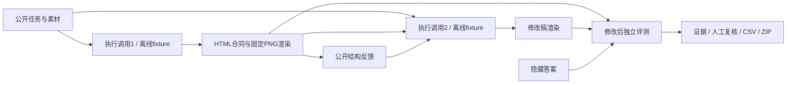

# PosterLab · 海报生成与评测实验台

依据 [项目执行计划](docs/plan.md) 构建的本地 Python + Streamlit 项目。已实现可操作网页、10个活动的数据集、固定浏览器渲染、一次修改状态机、规则评测、API 适配器、日志预算、人工复核和下载。

**当前交付为离线框架验收版。模型 ID 留空，真实 API 实测、双人事实核对、视觉评审校准和正式实验尚未完成。离线图片来自手写 fixture，视觉分数为空，不冒充模型结果。**

## 在线体验与 GitHub 部署

- 在线海报创作室：https://gjn12-31.github.io/posterlab/
- 公开仓库：https://github.com/gjn12-31/posterlab

`site/` 是无需服务端的 GitHub Pages 版本，支持三种风格、10个公开活动示例、即时预览、排版调整、浏览器本地作品保存和 1080×1440 PNG 下载。作品最多保留30个，保存在当前浏览器；清除站点数据会清空作品，请下载保存。

**在线版使用 Canvas 模板，不调用模型；文字布局检查不是完整评测或 AI 评分。完整生成、独立评审、人工复核和实验功能通过下方 Python / Streamlit 本地版运行。API Key 不得写入静态网页或提交到仓库。**

推送 `main` 后，`.github/workflows/pages.yml` 自动部署 `site/` 到 GitHub Pages。只有静态目录进入网页发布产物。首次配置在仓库 Settings → Pages → Source 选择 GitHub Actions。

本地预览在线版：

```bash
python3 -m http.server 8765 --directory site
# 打开 http://localhost:8765
```

重新生成网页示例：`.venv/bin/python scripts/build_site_samples.py`。网页端到端验证：`.venv/bin/python -m pytest tests/test_pages.py`。

## 立即打开本地完整版

本机环境已安装，在项目目录运行：

```bash
.venv/bin/streamlit run app.py --server.port 8501
```

访问 http://127.0.0.1:8501 。也可双击 `start_demo.command`。

1. 在「制作海报」填写自己的活动信息，或从10个公开活动示例开始。
2. 选择暖纸人文、蓝调学术、青绿漫想，点击「制作海报」。当前使用真实可渲染的离线模板。
3. 点击「优化一下」进行一次调整；使用「原版 / 优化版 / 前后对比」切换查看。
4. 点击「下载图片」直接获取 PNG；展开「需要可编辑文件？」可以打包源文件。
5. 所有作品在「我的作品」中保存，点击「打开作品」自动回到制作界面。

界面默认不展示任务 ID、原始 JSON、请求路径和英文状态码。「使用帮助 → 高级工具」保留服务设置、评测证据、人工复核和固定测试任务。

个人文案与风格保存为独立的 personal 作品快照，原有30条评测数据不会被修改；个人作品不进入默认实验统计。当前模板体验不伪造 AI 生成或视觉评分。

网页刷新、切换标签页和加载结果不发送 API 请求。状态以磁盘为准，按钮禁用以外还有文件锁与幂等检查。初稿和修改稿互不覆盖；修改失败不会拿初稿代替。

## 新环境安装

使用 Python 3.12（当前 3.12.14），macOS / Linux：

```bash
python3.12 -m venv .venv
source .venv/bin/activate
python -m pip install -r requirements.lock.txt
python -m pip install -e . --no-deps
python -m playwright install chromium
posterlab doctor
posterlab validate-data
python -m pytest
streamlit run app.py
```

若未安装 Python 3.12，可先用 uv 的 `uv python install 3.12` 和 `uv venv --python 3.12 .venv`。依赖锁不含本机 editable 绝对路径。字体已随工程提供，SIL OFL 许可见 `resources/fonts/LICENSE.txt`。Chromium 安装不需要 API Key。

当前验证环境：macOS ARM64、Python 3.12.14、Playwright 1.63.0、Chromium 153.0.8010.12、Streamlit 1.65.0。实际版本、字体 hash 由 `doctor` 保存到 `artifacts/environment.json`。

## 已实现的工作流



- 公开输入和答案分开；修改请求不接受 AnswerSpec，只接收公开反馈白名单。
- 渲染仅允许精确虚拟域名白名单，阻止脚本、外部网络、表单和自定义字体。截图固定1080×1440；保留原 HTML、注入环境后的 HTML、PNG、DOM几何。
- 检查唯一字段、最低子节点字号、画布边界、裁切、隐藏、图片加载与比例。复杂遮挡只形成候选与 unknown。
- 事实匹配采用 NFKC / 空白归一化与显式日期等价格式，旧日期在全局文本检查。
- 两种 API 协议均发送实际图片 base64；至多一次传输重试，内容错误不重试。原始 usage 保留，未知费用不记零。
- 执行最多2次逻辑调用；评审每阶段最多一次。已保存响应可继续本地处理，未知远端状态禁止自动重发。
- 评审单图匿名、顺序可固定打乱；严格 JSON 验证，缺字段/越界分不自动补齐。
- 原始与人工裁定后的评价分别保存。审美分不能覆盖事实/交付错误，四维分数不合成百分制。

## 数据与来源

`data/collected_events.json` 是收集的 **10条独立活动记录**；来源清单为 `data/source_manifest.jsonl`。具体来源例如 [AI as a Lens](https://iiis.tsinghua.edu.cn/en/info/1044/2824.htm)、[Robotic Dexterity](https://iiis.tsinghua.edu.cn/en/info/1044/2828.htm)。全部详情 URL、访问时间与原页面 hash 均在清单中。

为覆盖计划的三种条件，10场活动各生成标准/日期更新/长文本，共30任务。e001/e002为开发，余下8场为测试；没有跨集合变体。相对原计划7场/21任务的变化记录在 `docs/decisions.md`。

```bash
# 使用缓存；--refresh 才重新获取已有网页
.venv/bin/python scripts/collect_sources.py
# 从缓存重建任务（会重建工作数据，不应在正式冻结后使用）
.venv/bin/python scripts/build_tasks.py
.venv/bin/posterlab validate-data
# 正式校验当前会因缺双人复核而失败，这是预期行为
.venv/bin/posterlab validate-data --formal
```

日期更新是实验构造，并非活动真的改期。简介为项目整理的中文摘要，原始英文资料另存，待双人核对。演示 Logo 和主题图为项目原创几何图案，不冒用学校标识；不是官方活动海报。详细说明见 `docs/data_readme.md`。

## CLI

```bash
.venv/bin/posterlab doctor
.venv/bin/posterlab render-fixture --name valid --out work/fixture-valid
.venv/bin/posterlab run --task e001-standard --mode demo
.venv/bin/posterlab inspect --run RUN_ID
.venv/bin/posterlab resume --run RUN_ID
.venv/bin/posterlab export --run RUN_ID --stage revised
.venv/bin/posterlab batch --batch-id demo-dev --split dev --phase all
.venv/bin/posterlab aggregate --include-demo
.venv/bin/posterlab report --include-demo
.venv/bin/python scripts/verify_fixtures.py
.venv/bin/python scripts/build_calibration.py
```

默认统计排除 demo。`--include-demo` 输出单独 demo 报告，不与真实成绩混合。报告和统计重建不会调用 API。比例保存分子/分母，分母0为 null。

## 真实 API 接入（留待框架验收后）

```bash
cp .env.example .env
# 本地编辑 .env，填入 DASHSCOPE_API_KEY / ANTHROPIC_API_KEY
# 编辑 configs/dev.yaml，填入账户确实可用的两个 model ID
.venv/bin/posterlab doctor
.venv/bin/posterlab run --task e001-standard --mode dev
```

执行端使用 DashScope OpenAI-compatible chat，评审端使用 Anthropic Messages。模型名称不照抄计划中的未验证示例。区域地址需与账户匹配。密钥不会写入 YAML、页面、请求快照或 ZIP。

默认 Pilot 全局上限4次真实 HTTP尝试，正常完整链路为2次执行+2次评审。`smoke --role executor/judge` 和传输重试也占用此额度；不能先做2次 smoke 后假定还剩4次。API服务尚未实测，具体账号兼容性和计费需验证。

金额配置尚为空。正式请求需设置经确认的币种、金额上限和每次费用预留。费用未能精确计算时保留 usage、预留和 unknown；本版没有假装掌握图像/缓存细分定价。Pilot 费用未核账时正式批次会阻止。

正式冻结/批次入口已实现，但当前数据未核对、模型未配置、校准未完成，因此不会通过前置检查：

```bash
posterlab freeze --experiment posterlab-v1
posterlab batch --batch-id formal-v1 --experiment posterlab-v1 --split test --phase execute
posterlab batch --batch-id formal-v1 --experiment posterlab-v1 --split test --phase judge
posterlab audit-sample --experiment posterlab-v1
```

冻结保存代码/数据/字体/配置/提示词/依赖与环境；变动后拒绝继续。正式批次先执行，再全批次匿名打乱图像评审顺序。校准通过记录位于 `artifacts/calibration/accepted.json`，需要真实10次评审及两位不同复核人，不能将离线校准样例当成通过。

## 目录

- `app.py`：Streamlit 编排和界面。
- `src/posterlab/`：schema、任务、渲染、检查、调用、预算、状态机、统计、导出。
- `configs/`、`prompts/`：独立配置及提示词。
- `data/tasks/*/public/`：执行模型可读资料。
- `data/answers/`：评测专用答案，未双人核对。
- `data/sources/`：10场活动原网页和正文快照。
- `runs/<run_id>/`：不可混淆的初稿/终稿、请求响应、检查和评价。
- `artifacts/ledger/`：全局真实请求账本；当前没有付费调用。
- `tests/`：离线合同、泄漏边界、重试/预算、状态恢复、统计、真实渲染和页面测试。
- `docs/`：决策、数据说明、评分标准、导师记录、后续验收和提交清单。

`runs/`、`artifacts/` 被 gitignore，仍须自行保存实验归档。课程最终 Word、市场与步骤 HTML、Proposal 尚未生成真实实验结论；待 API 实测后再制作，见 `docs/next_steps.md`。
